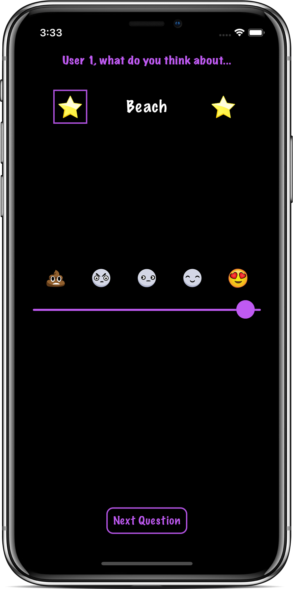
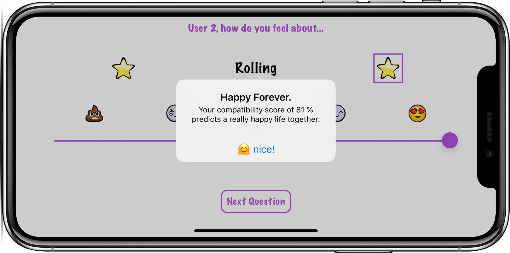
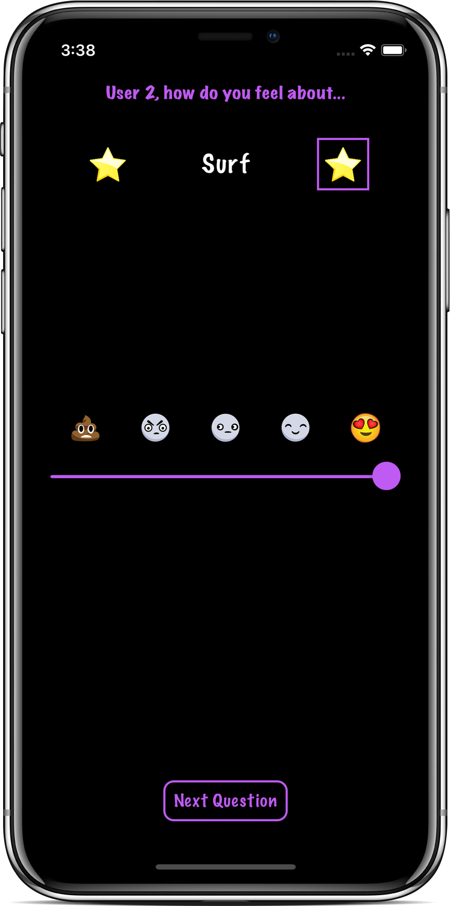

**Week 04.**

### Compatibility Slider: 
CompatibilitySlider gives you a compatibility percentage between two persons after each one evaluates different topics.  

<!-- I´m gonna substitute the table with images for a parragraph in html tags to obtain the same result but without the table lines
|  |  |  |
| --- | --- | --- |  
-->

	
	
	

## Tech Stack.
- Storyboards
- AutoLayout
- UIKit

## Final Considerations.  

### As for the **UI** of the app I did the following updates:
- I have **created a CompatibilityGame Model** which is the Model of the app.  
- Control between the Model and the UI is performed by the Controller (our viewController in the app), BUT **I added a `func restart()`method to the Model** just because in my opinion **the model should be able to control** its initial state during the game, I mean **not all the states** but **at least the initial one (the reset())**, performing the default operations to prepare it to be used by the Controller. The controller is who gives the order to reset it (it made a call to reset() using the game object instantiated in it, and takes control of other settings that are being controlled by itself).
- Added StackViws and constraints to Story Board:
- A **touch of color was given** to made it a little nicer, and usable, in both **light and dark modes** as well as **land and portrait orientations**.
- Even **a "frame" was added to** the left and right **stars image views**: **The goal of this frame is to help visualizing which player owns the turn at any moment.  

### For the **"Logic"** part what I did was:  
- Instead of only two topics, now we will have a **randomly chosen set of topics**.
- **Value of the slider was kept between 1 and 5** as it was originally designed: this way the **minimum compatibility score** we are able to obtain **will be 20%** ... We do not want to potentially discourage future couples you know ^_^!.
- It has been **introduced "compatibility zones"**: this way **each "zone" will display a different value for tittle, message and action button text** during test results. 
- **First Results** View will be shown (it is an AlertView), and **later** ,after pressing the "ok" action button, **the game will be reset**. 
(The assignment specified the opposite... but I think this way the UI is less confusing).

### Added the Unit Tests for the game model methods

- I have divided the tests in two categories:
  - **Black-box tests:**: where only the exposed api methods have been tested.
  - **White-box tests:**  where I have tested the private ones.

