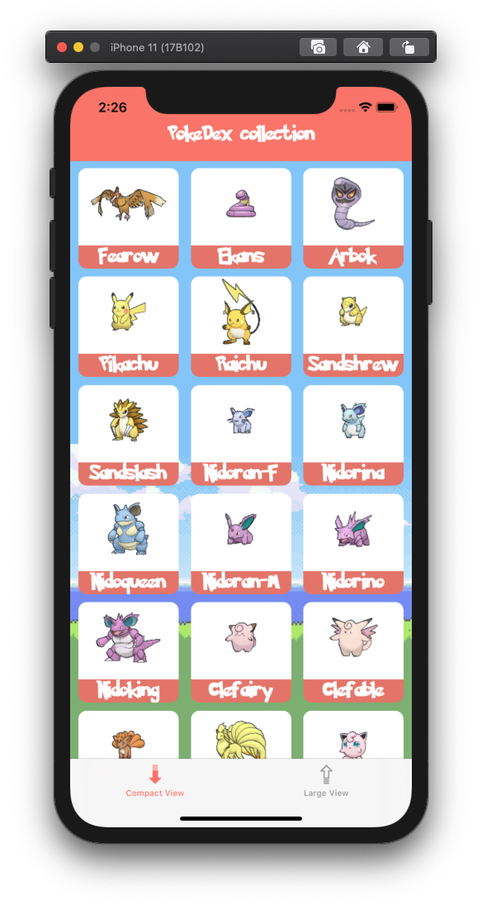
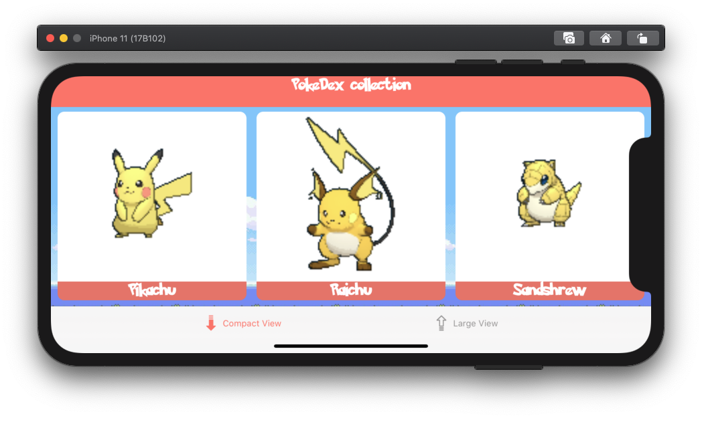
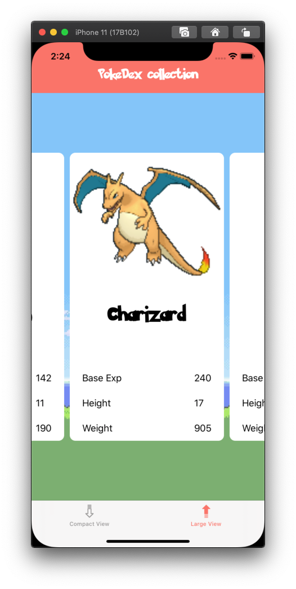

# Week 06 (Monday 29 June to Sunday 5 July)

## PokeDex
<!-- I´m using html paragraph tag in order to do not show the table lines
|  |  |  |
| --- | --- | --- |
-->

	
	
	

This week homework consists in create our own pokedex using a started project:
- it is mandatory 3 columns of cards in portrait and landscape (whatever the screensize is) using the first tab bar item
- for the second tab bar item we just have to show 1 card in portrait mode

>possible improvements in the future:
> - do the same project using diffable data source and compositional layout

